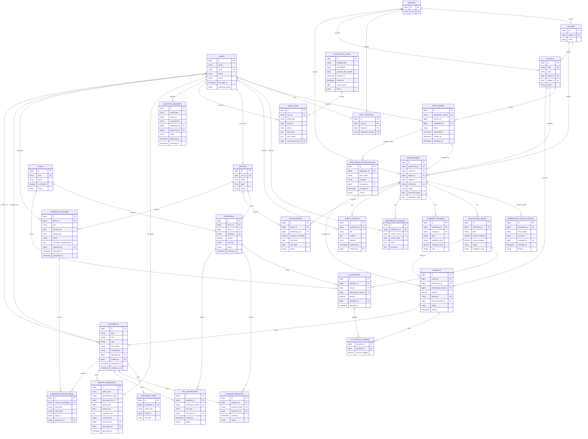

# Entity Relationship Diagram

```mermaid
erDiagram
    USERS ||--o| STAFF_PROFILES : has
    REGIONS ||--o{ VILLAGES : contains
    REGIONS ||--o{ STAFF_PROFILES : assigns
    REGIONS ||--o{ SCHOOLS : contains
    VILLAGES ||--o{ SCHOOLS : contains

    SCHOOLS ||--o{ APPLICATIONS : submits
    USERS ||--o{ APPLICATIONS : submits
    APPLICATIONS ||--o| BENEFICIARIES : accepted_as
    APPLICATIONS ||--o{ APPLICATION_STATUS_HISTORY : changes_status

    REGIONS ||--o{ BENEFICIARIES : locates
    VILLAGES ||--o{ BENEFICIARIES : locates
    SCHOOLS ||--o{ BENEFICIARIES : educates
    BENEFICIARIES ||--o{ BENEFICIARY_STATUS_HISTORY : changes_status

    BENEFICIARIES ||--o{ EDUCATIONAL_NEEDS : has
    BENEFICIARIES ||--o{ ACADEMIC_RECORDS : has
    BENEFICIARIES ||--o{ MENTORSHIP_SESSIONS : has
    BENEFICIARIES ||--o{ IMPACT_UPDATES : has
    BENEFICIARIES ||--o{ SPONSORSHIPS : receives

    USERS ||--o{ MENTORSHIP_SESSIONS : mentors
    USERS ||--o{ IMPACT_UPDATES : creates

    USERS ||--o| DONORS : may_link_to
    DONORS ||--o{ DONATIONS : gives
    DONORS ||--o{ SPONSORSHIPS : sponsors
    DONORS ||--o{ EVIDENCE_PACKAGES : receives

    FUNDS ||--o{ DONATIONS : receives
    DONATIONS ||--o{ ALLOCATIONS : funds
    DONATIONS ||--o{ DONATION_RECEIPTS : issues
    DONATIONS ||--o{ TAX_CERTIFICATES : certifies
    FUNDS ||--o{ ALLOCATIONS : source
    EDUCATIONAL_NEEDS ||--o{ ALLOCATIONS : receives

    SCHOOLS ||--o{ PAYMENTS : receives
    BENEFICIARIES ||--o{ PAYMENTS : supported_by
    EDUCATIONAL_NEEDS ||--o{ PAYMENTS : paid_for
    ALLOCATIONS ||--o{ ALLOCATION_PAYMENT : applied
    PAYMENTS ||--o{ ALLOCATION_PAYMENT : uses

    DOCUMENTS }o--|| USERS : uploaded_by
    DOCUMENTS }o--o| USERS : verified_by
    PAYMENTS ||--o| DOCUMENTS : proof
    DOCUMENTS ||--o{ DOCUMENT_LINKS : links
    DOCUMENTS ||--o{ DONATION_RECEIPTS : stores
    DOCUMENTS ||--o{ TAX_CERTIFICATES : stores
    DOCUMENTS ||--o{ REPORT_SNAPSHOTS : stores
    DOCUMENTS ||--o{ EVIDENCE_PACKAGE_ITEMS : supports

    USERS ||--o{ AUDIT_LOGS : performs
    USERS ||--o{ DELETION_REQUESTS : requests
    USERS ||--o{ REPORT_SNAPSHOTS : generates
    USERS ||--o{ EVIDENCE_PACKAGES : approves
    AUDIT_EVENT_FILES ||--o{ AUDIT_LOGS : exports

    EVIDENCE_PACKAGES ||--o{ EVIDENCE_PACKAGE_ITEMS : contains

    USERS {
        bigint id PK
        string name
        string email UK
        string phone
        string status
        timestamp last_login_at
        string preferred_locale
    }

    STAFF_PROFILES {
        bigint id PK
        bigint user_id FK
        bigint region_id FK
        string employee_number UK
    }

    REGIONS {
        bigint id PK
        string name UK
    }

    VILLAGES {
        bigint id PK
        bigint region_id FK
        string name
    }

    SCHOOLS {
        bigint id PK
        string code UK
        string name
        bigint region_id FK
        bigint village_id FK
        string status
    }

    APPLICATIONS {
        bigint id PK
        string application_number UK
        bigint school_id FK
        bigint submitted_by FK
        string status
        timestamp submitted_at
        timestamp verified_at
        timestamp reviewed_at
    }

    BENEFICIARIES {
        bigint id PK
        bigint application_id FK
        bigint school_id FK
        bigint region_id FK
        bigint village_id FK
        string internal_id UK
        string status
        date admission_date
        date graduation_date
    }

    EDUCATIONAL_NEEDS {
        bigint id PK
        bigint beneficiary_id FK
        string type
        decimal amount_required
        decimal amount_funded
        string status
        string academic_year
    }

    DONORS {
        bigint id PK
        bigint user_id FK
        string email
        string type
        string status
    }

    FUNDS {
        bigint id PK
        string slug UK
        string name
        boolean is_restricted
        string status
    }

    DONATIONS {
        bigint id PK
        bigint donor_id FK
        bigint fund_id FK
        string reference UK
        decimal amount
        string currency
        string status
        timestamp received_at
    }

    ALLOCATIONS {
        bigint id PK
        bigint donation_id FK
        bigint fund_id FK
        bigint educational_need_id FK
        decimal amount
        bigint allocated_by FK
        timestamp allocated_at
    }

    PAYMENTS {
        bigint id PK
        bigint school_id FK
        bigint beneficiary_id FK
        bigint educational_need_id FK
        decimal amount
        string reference UK
        bigint proof_document_id FK
        string status
        timestamp paid_at
    }

    ALLOCATION_PAYMENT {
        bigint allocation_id FK
        bigint payment_id FK
        decimal amount_applied
    }

    SPONSORSHIPS {
        bigint id PK
        bigint donor_id FK
        bigint beneficiary_id FK
        decimal amount_committed
        date start_date
        date end_date
        string status
    }

    ACADEMIC_RECORDS {
        bigint id PK
        bigint beneficiary_id FK
        bigint school_id FK
        string term
        string academic_year
        decimal average_score
        string rank
    }

    MENTORSHIP_SESSIONS {
        bigint id PK
        bigint beneficiary_id FK
        bigint mentor_user_id FK
        date session_date
        text notes
        text outcomes
    }

    IMPACT_UPDATES {
        bigint id PK
        bigint beneficiary_id FK
        string title
        text content
        string visibility
        timestamp published_at
        bigint created_by FK
    }

    DOCUMENTS {
        bigint id PK
        string type
        string title
        string path
        string file_sha256
        string classification
        bigint uploaded_by FK
        bigint verified_by FK
        timestamp generated_at
        timestamp retention_until
    }

    DOCUMENT_LINKS {
        bigint id PK
        bigint document_id FK
        string entity_type
        bigint entity_id
        string link_role
    }

    AUDIT_LOGS {
        bigint id PK
        bigint user_id FK
        string entity_type
        bigint entity_id
        string action
        json old_values
        json new_values
        bigint audit_event_file_id FK
    }

    AUDIT_EVENT_FILES {
        bigint id PK
        string storage_path
        string file_sha256
        string previous_file_sha256
        timestamp opened_at
        timestamp closed_at
        bigint event_count
        string status
    }

    APPLICATION_STATUS_HISTORY {
        bigint id PK
        bigint application_id FK
        string from_status
        string to_status
        bigint changed_by FK
        timestamp changed_at
        string reason
    }

    BENEFICIARY_STATUS_HISTORY {
        bigint id PK
        bigint beneficiary_id FK
        string from_status
        string to_status
        bigint changed_by FK
        timestamp changed_at
        string reason
    }

    DELETION_REQUESTS {
        bigint id PK
        string entity_type
        bigint entity_id
        string classification
        bigint requested_by FK
        bigint approved_by FK
        string status
        timestamp approved_at
        timestamp executed_at
    }

    DONATION_RECEIPTS {
        bigint id PK
        bigint donation_id FK
        string receipt_number UK
        bigint document_id FK
        timestamp issued_at
        string status
    }

    TAX_CERTIFICATES {
        bigint id PK
        bigint donation_id FK
        string certificate_number UK
        string tax_year
        bigint document_id FK
        timestamp issued_at
        string status
    }

    REPORT_SNAPSHOTS {
        bigint id PK
        string report_type
        string generated_for_type
        bigint generated_for_id
        date period_start
        date period_end
        json snapshot_json
        string source_hash
        bigint document_id FK
        bigint generated_by FK
        timestamp generated_at
    }

    EVIDENCE_PACKAGES {
        bigint id PK
        bigint donor_id FK
        string title
        date period_start
        date period_end
        string status
        json summary_snapshot_json
        bigint approved_by FK
        timestamp approved_at
        timestamp generated_at
    }

    EVIDENCE_PACKAGE_ITEMS {
        bigint id PK
        bigint evidence_package_id FK
        string item_type
        string entity_type
        bigint entity_id
        bigint document_id FK
    }
```

